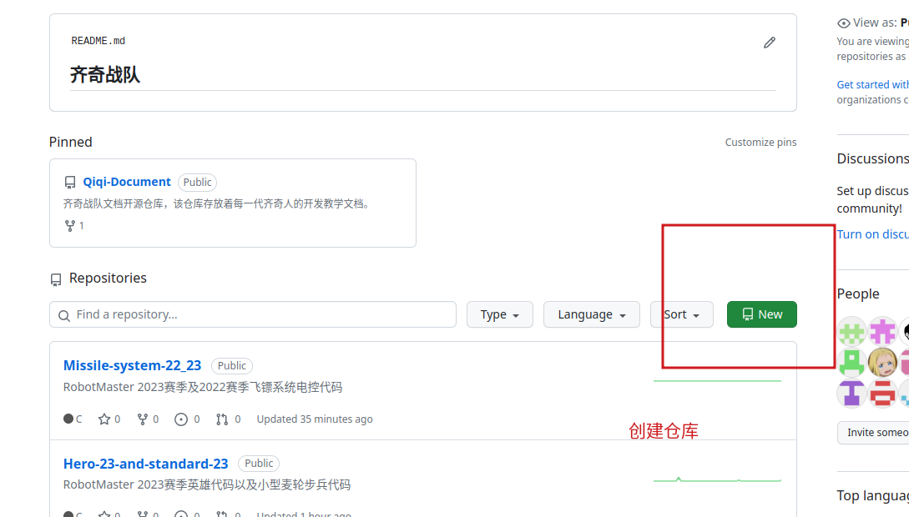
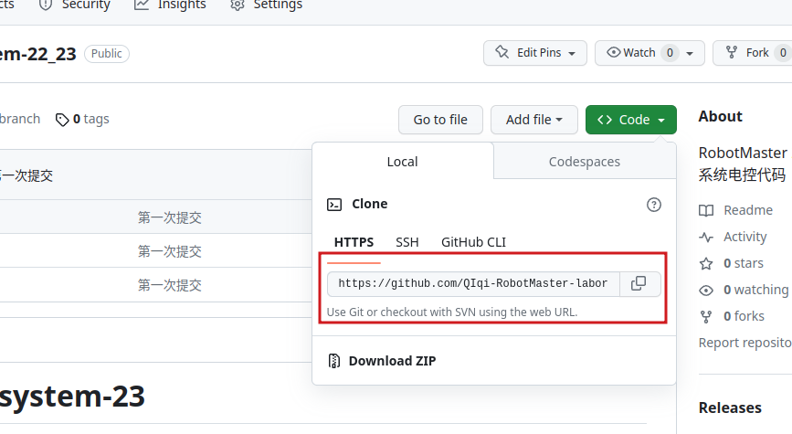
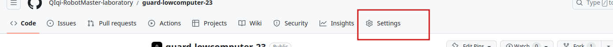
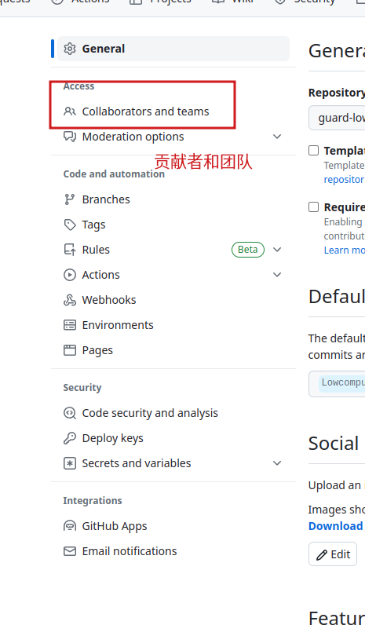
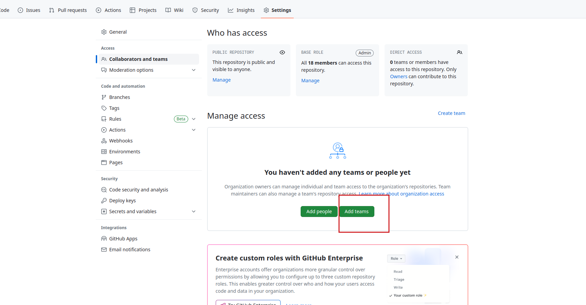

# 贡献代码简要说明

如果您想贡献您的代码，但是无从下手，请参考如下流程

## 创建github仓库

首先在本组织内创建你的仓库。

---

创建完毕后将仓库克隆到本地

复制链接中的地址。然后打开终端，输入

```bash
git clone 你的仓库的链接地址
```

---

将你要贡献代码或文件拷贝到从远程克隆的本地仓库中

---

添加代码到暂存区，在终端中输入

```bash
git add *
```

---

添加代码到本地仓库

```bash
git commit -m "提交说明"
```

---

将代码从本地仓库上传合并到远程仓库

```bash
git push
```

## 特别说明

如果您属于本组织的某个团队(team)的一员，建议将您创建的仓库放于您所属的团队仓库。方法如下

1. 进入您创建的仓库，点击Settings
2. 点击Collaborators and teams
3. 点击添加团队。
4. 输入团队名称，点击确认。
