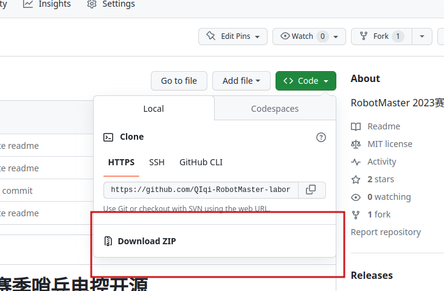

# 贡献代码简要说明

如果您想贡献您的代码，但是无从下手，请参考如下流程

## 个人贡献代码流程

首先在本组织内创建你的仓库。

创建完毕后将仓库克隆到本地

复制链接中的地址。打开终端或命令行，在其中输入

```bash
git clone 仓库的链接
```

将你要贡献代码或文件拷贝到从远程克隆的本地仓库中

添加代码到暂存区，在终端中输入

```bash
git add *
```

添加代码到本地仓库

```bash
git commit -m "提交说明"
```

将代码从本地仓库上传合并到远程仓库

```bash
git push
```

### 特别说明

如果您属于本组织的某个团队(team)的一员，建议将您创建的仓库放于您所属的团队仓库。方法如下

1. 进入您创建的仓库，点击Settings
2. 点击Collaborators and teams
3. 点击添加团队。
4. 输入团队名称，点击确认。

## 代码开发者间的迭代

由于我们的代码需要进行开发者间的迭代，作为下一代项目软件开发者，需要在上一代的基础上进行开发。那么如何实现这个过程呢。

首先您可以在你的个人仓库或组织仓库创建您自己的代码仓库。

然后克隆您创建的仓库到本地

```bash
git clone 仓库地址
```

将您要进行迭代的基础项目直接下载到本地

将下载的压缩包解压到您自己创建的仓库中，然后您就可以开发您的代码了。

开发到达要保存历史版本的时候，在终端或命令行中输入

```bash
git add *
```

将您的本地代码添加到暂存区内

然后在终端或命令行中输入，将暂存区的代码提交到本地仓库

```bash
git commit -m "提交说明"
```

最后输入

```bash
git push
```

将本地仓库的代码提交到远程您创建的仓库。

## 多人开发

如果您的项目未来要多人开发，你可以在创建github仓库并克隆到本地后按如下过程进行开发。

多人开发最大的问题在于版本不协调的问题，于多人提交到同一个远程仓库而产生我的本地仓库与远程仓库不是同一个版本的问题。所以我们先将本地仓库与远程仓库同步，使用如下命令。

```bash
#更新本地仓库与远程仓库同步
git pull
```

下一步添加到暂存区

```bash
git add *
```

提交到本地仓库

```bash
git commit -m "提交说明"
```

提交到远程仓库

```bash
git push
```
